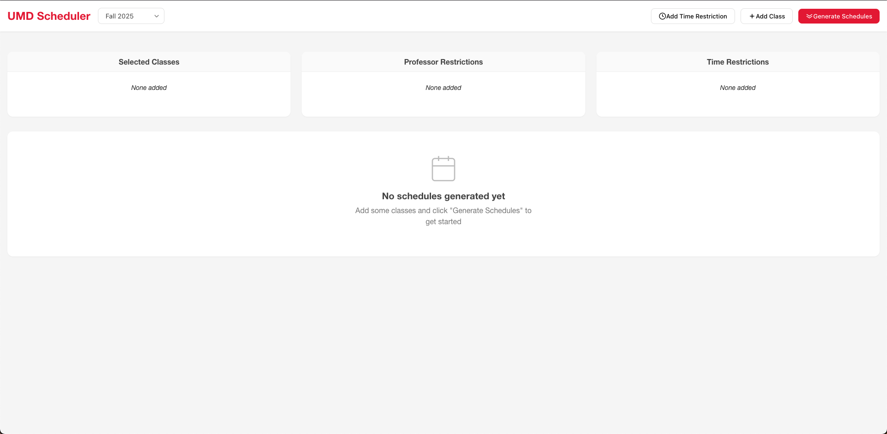
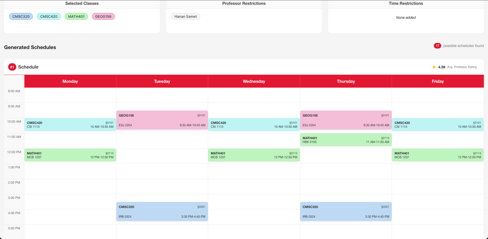
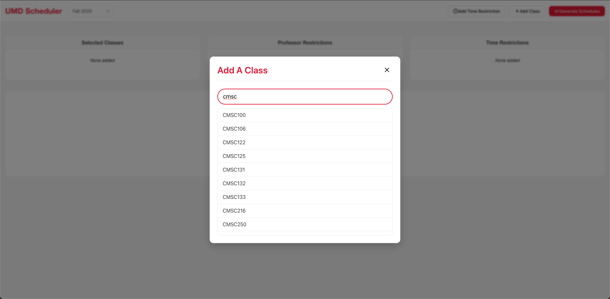

# UMDScheduler

UMDScheduler is a web-based application designed to help students at the University of Maryland (UMD) efficiently manage their course schedules. The application allows users to input their desired courses and generates a schedule that minimizes conflicts and maximizes free time.

Try it out at [umdscheduler.vercel.app](https://umdscheduler.vercel.app/)!

## Features

- **Course Search**: Search for courses by department or course number.
- **Time Conflict Resolution**: Automatically detects and resolves time conflicts between courses.
- **Schedule Optimization**: Generates an optimal schedule based on user preferences.
- **Professor Ratings**: Displays ratings and reviews for professors teaching the selected courses, sourced from PlanetTerp.
- **Custom Restrictions**: Allows users to set custom restrictions for their schedules, such as preferred time slots or days of the week.

## Screenshots

## Architecture

### Frontend

Built with Svelte, the frontend of UMDScheduler provides a user-friendly interface for students to interact with the application. It includes features such as course search, schedule generation, and professor ratings.

### Backend

The backend is built with Python and Flask, providing a RESTful API for the frontend to interact with. It handles course data retrieval, schedule generation, and professor ratings.
